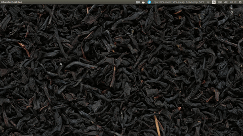

# suckless-yt
Suckless youtube player based on `dmenu` and `mpv`.
It's only provides the ability to watch last videos from channels you like.

### Demo


### Deps
- [`mpv`](https://mpv.io/)
- [`dmenu`](https://tools.suckless.org/dmenu/)
- [`youtube-dl`](https://ytdl-org.github.io/youtube-dl/index.html)
- `curl`
- [`pup`](https://github.com/ericchiang/pup)

### Install
Simply run `make install` **without `sudo`!**

Now all files are copied to `$HOME/bin`. Make sure it's in your `PATH` variable. Alternatively, you can copy all scripts from repo to any location you want and add that location to the `PATH`.

### Exporting your subscriptions to config file
Now list all channels links you want in `$HOME/.config/suckless-yt/channels.txt`

You can also automate this process by giving `subscription_manager` file to `get-channels-from-subsctiption-file.sh`:

```bash
get-channels-from-subsctiption-file.sh <path to subscription_manager file> > ~/.config/suckless-yt/channels.txt
```

**Please run `update-channels.sh` after every change to config file!**

To get `subscription_manager` file login on YouTube with your account and follow [this link](https://youtube.com/subscription_manager?action_takeout=1).

### Using
run `suckless-yt` to choose videos from your channels or `last-videos.sh` to choose from latest videos from each of your channels

### Uninstall
run `make uninstall`
